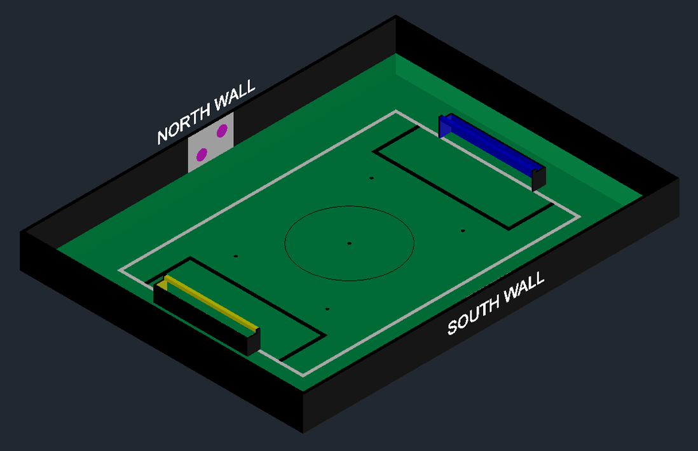
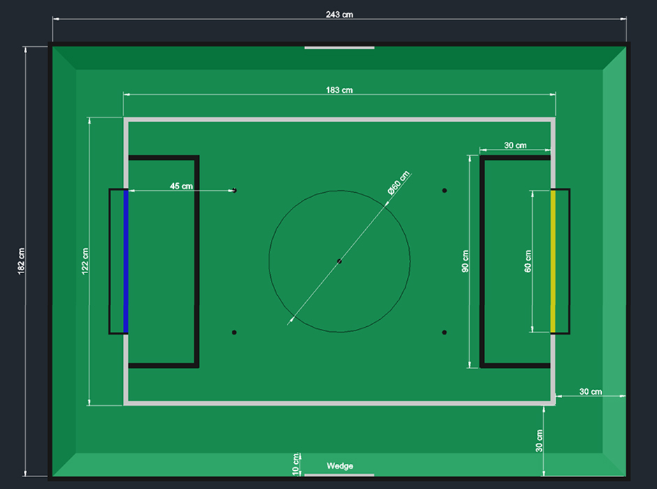
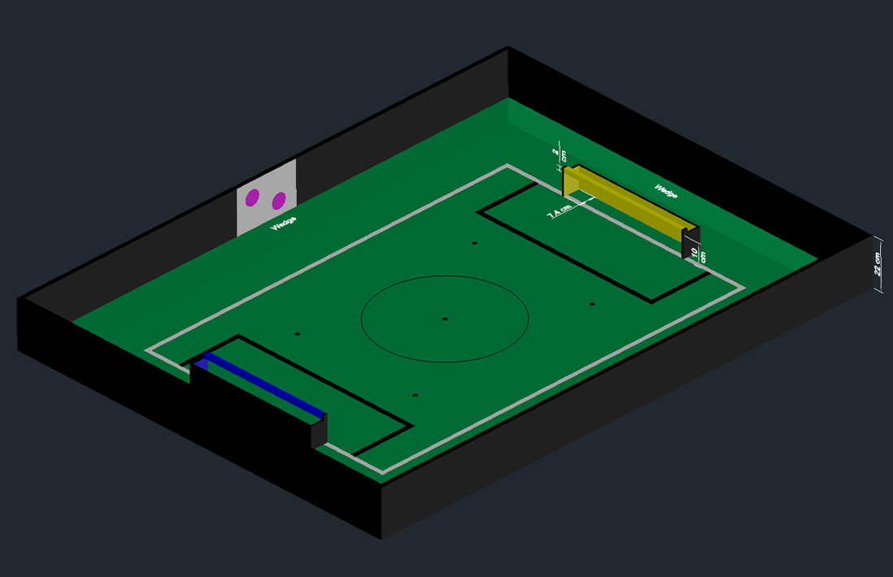
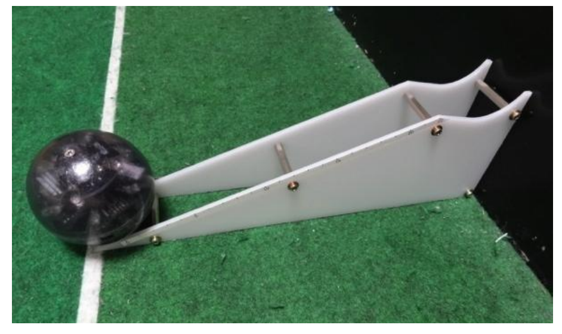
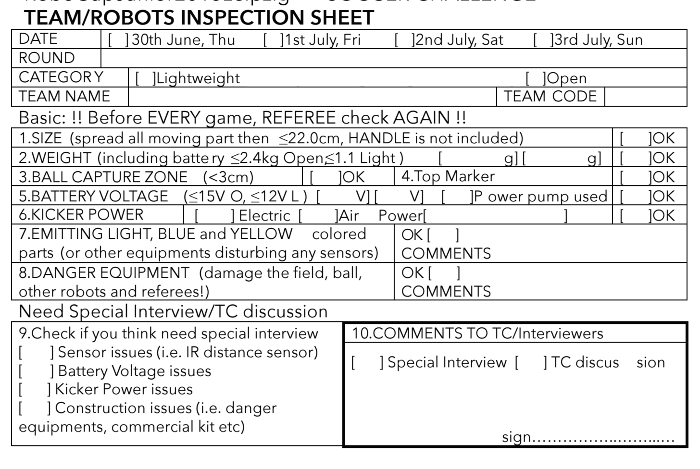
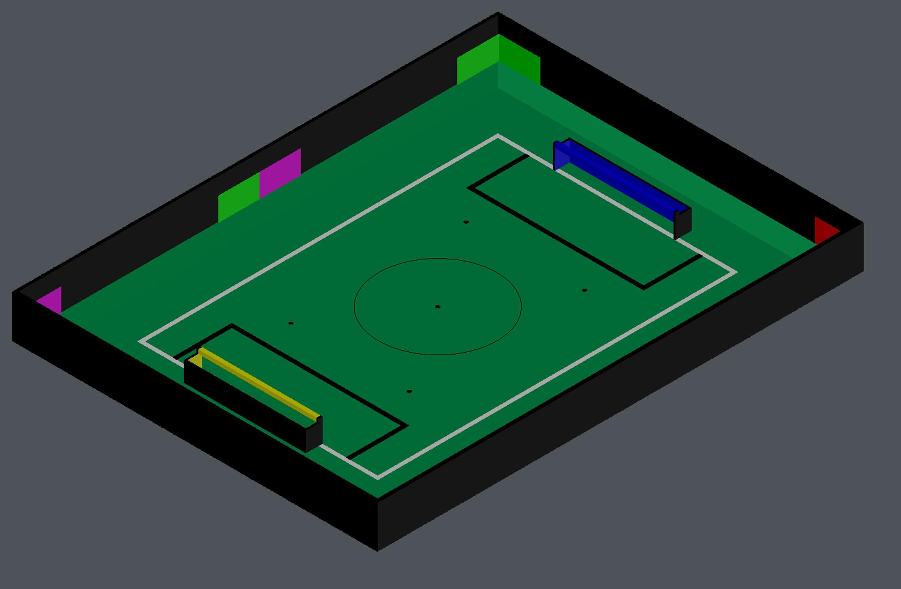
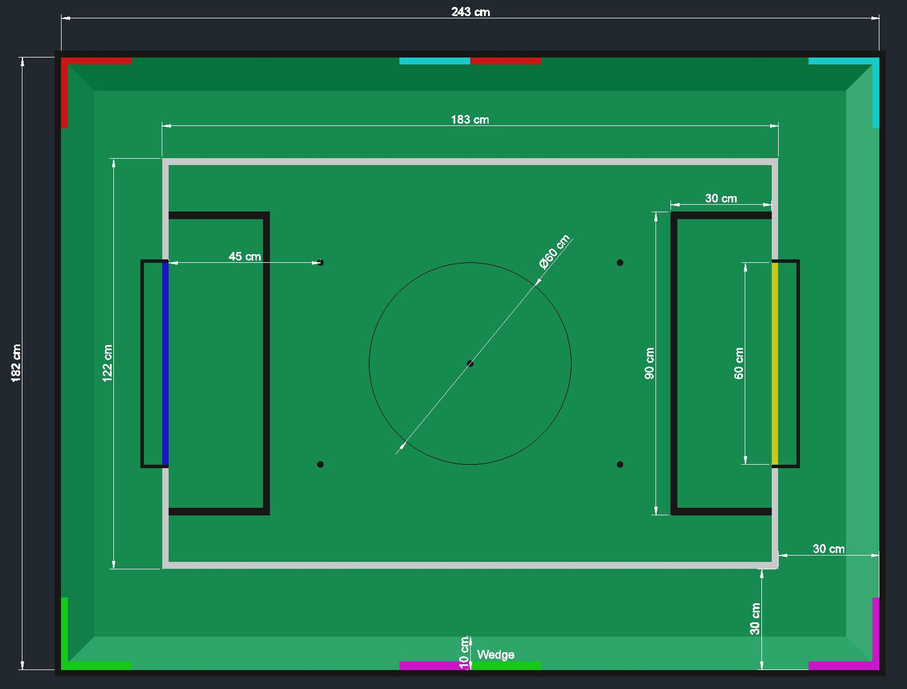
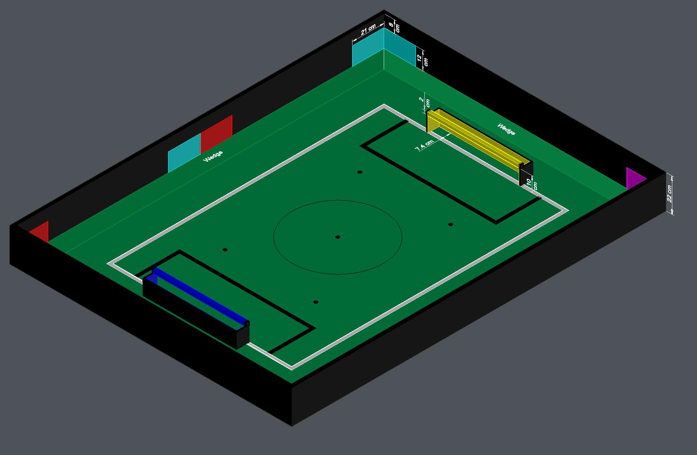

**Soccer Technical Committee 2018:**

These are the official Soccer rules for RoboCupJunior 2018. They are
released by the RoboCupJunior Soccer Technical Committee. The English
version of these rules has priority over any translations.

Teams are advised to check the RoboCupJunior Soccer site
<http://rcj.robocup.org/soccer.html> for OC (Organizational Committee)
procedures and requirements for the international competition. Each team
is responsible for verifying the latest version of the rules prior to
competition.

Preface {#preface .unnumbered}
=======

In the RoboCupJunior soccer challenge, teams of young engineers design,
build, and program two fully autonomous mobile robots to compete against
another team in matches. The robots must detect a ball and score into a
color-coded goal on a special field that resembles a human soccer field.

To be successful, participants must demonstrate skill in programming,
robotics, electronics and mechatronics. Teams are also expected to
contribute to the advancement of the community as a whole by sharing
their discoveries with other participants and by engaging in good
sportsmanship,regardless of culture, age or result in the competition.
**All are expected to compete, learn, have fun, and grow.**

RoboCupJunior Soccer consist of two sub-leagues:

**“Soccer Open”** and **“Soccer Lightweight”**. These rules apply for
both sub-leagues. There are two main differences between the two
leagues.

**“Soccer Lightweight”** is played using a special ball that emits an IR
signal ball. Robots may weigh up to 1.1 kg, may have a ball-capturing
zone of up to 3.0 cm, and may use batteries up to 12.0 nominal voltage.

**“Soccer Open”** is played using a passive, brightly colored orange
ball. Robots may weigh up to 2.4 kg, may have a ball-capturing zone of
up to 2.5 cm, and may use batteries up to 15.0 nominal voltage.

*Please see \[section:ball\]. Ball, for balls specifications and
\[section:league\_regulations\]. League Regulations, for more details
for specifications/regulations*.

![Two teams of two robots with an orange ball on a RoboCupJunior Soccer
field.[]{data-label="fig:name"}](media/image1_new.jpeg){width="70.00000%"}

Changes from 2017 RoboCupJunior Soccer Rules {#changes-from-2017-robocupjunior-soccer-rules .unnumbered}
============================================

The changes determined by the Technical Committee for this year’s rules
aim to fix some organizational loopholes which have been identified in
the past few years, further standardize the playing field, bring more
transparency to the process of inspections and interviews, and bridge
the gap between the Junior and Major competitions by providing more
opportunities for incorporating more computer vision and artificial
intelligence methods.

Construction and Programming have to be performed exclusively by the students {#construction-and-programming-have-to-be-performed-exclusively-by-the-students .unnumbered}
=============================================================================

Robots must be constructed and programmed exclusively by student members
of the team. Mentors, teachers, parents or companies should not be
involved in the design, construction, assembly, programming or debugging
of robots. To avoid embarrassment and possible disqualification, it is
extremely important that teams abide by - 8.League Regulations - 8.2.3
Construction - and - 8.2.4 Programming - (found toward the end of this
document) and all other competitor’s rules. If in doubt, please consult
with your Regional Representative before registering your team.

GAMEPLAY \[ref-001\]
====================

Game procedure and length of a game \[ref-002\]
-----------------------------------------------

RCJ Soccer games consist of two teams of robots playing soccer against
each other. Each team has two autonomous robots. The game will consist
of two halves. The duration of each half is 10-minutes. There will be a
5-minute break in between the halves.

The game clock will run for the duration of the halves without stopping
(except if or when a referee wants to consult another official). The
game clock will be run by a referee or a referee assistant (see Rule 7.1
for the description of a referee assistant).

Teams are expected to be on the field 5 minutes before their game
starts. Being at the inspection table does not count in favor of this
time limit. Teams that are late for the start of the game can be
penalized one goal per 30 seconds at the referee’s discretion. In this
(and any) situation, when the goal differential reaches 10 the game
finishes regardless of the state of the game clock.

Pre-match meeting \[ref-003\]
-----------------------------

At the start of the first half of the game, a referee will toss a coin.
The team mentioned first in the draw shall call the coin. The winner of
the toss can choose either which end to kick towards, or to kick off
first. The loser of the toss chooses the other option. After the first
half, teams switch sides. The team not kicking off in the first half of
the game will kick off to begin the second half of the game.

Kick-off \[ref-004\]
--------------------

Each half of the game begins with a kick-off. All robots must be located
on their own side of the field. All robots must be halted. The ball is
positioned by a referee in the center of the field.

The team kicking off places their robots on the field first. Robots
cannot be placed nor remain behind the goal line or in the outer area.
Robots cannot be repositioned once they have been placed.

The team not kicking off will now place their robots on the defensive
end of the field. All robots on the team not kicking off must be at
least 30 cm away from the ball (outside of the center circle).

Robots cannot be placed behind the goal line or out of bounds. Robots
cannot be repositioned once they have been placed, except if the referee
requests to adjust their placement to make sure that the robots are
placed properly within the field positions.

On the referee’s command (usually by whistle), all robots will be
started immediately by each captain. Any robots that are started early
will be removed by the referee from the field and treated as a damaged
robot.

Human interference\[ref-005\]
-----------------------------

Except for the kick-off, human interference from the teams (e.g.
touching the robots) during the game is not allowed unless explicitly
permitted by a referee. Violating team/team member(s) can be
disqualified from the game.

The referee or a referee assistant can help robots get unstuck if the
ball is not being disputed near them and if the situation was created
from normal interaction between robots (i.e. it was not a design or
programming flaw of the robot alone). The referee or a referee assistant
will pull back the robots just enough for them to be able to move freely
again.

Ball movement \[ref-ball-movement\]
-----------------------------------

A robot cannot hold a ball. Holding a ball is defined as taking full
control of the ball by removing all of degrees of freedom. Examples for
ball holding include fixing a ball to the robot’s body, surrounding a
ball using the robot’s body to prevent access by others, encircling the
ball or somehow trapping the ball with any part of the robot’s body. If
a ball does not roll while a robot is moving, it is a good indication
that the ball is trapped.

The only exception to holding is the use of a rotating drum (a
“dribbler”) that imparts dynamic back spin on the ball to keep the ball
on its surface.

Other players must be able to access the ball.

Scoring \[ref-007\]
-------------------

A goal is scored when the ball strikes or touches the back wall of the
goal. Goals scored either by an attacking or defending robot have the
same end result: they give one goal to the team on the opposite side.
After a goal, the game will be restarted with a kick-off from the team
who was scored against. Before a kick-off, all damaged or out-of-bounds
robots are allowed to return to the playing field immediately if they
are ready and fully functional.

Goalie \[ref-008\]
------------------

The robot moving first into the penalty area on a team’s defending side
completely (with every part of it) is designated as goalie until a part
of it leaves the penalty area.

Pushing \[ref-pushing\]
-----------------------

Within the penalty area, the goalie has priority. Attacking robots are
not supposed to push the goalie in any way.

If the attacker and the goalie touch each other and at least one of them
has physical contact with the ball, the ball will be moved to the
nearest unoccupied neutral spot immediately.

If a goal is scored as a result of this pushed-situation, it will not be
granted.

Lack of progress \[ref-lack-of-progress\]
-----------------------------------------

Lack of progress occurs if there is no progress in the gameplay for a
reasonable period of time and the situation is not likely to change.
Typical lack of progress situations are when the ball is stuck between
robots, when there is no change in ball and robot’s positions, or when
the ball is beyond detection or reach capability of all robots on the
field.

After a visible and loud count[^1], a referee will call “lack of
progress” and will move the ball to the nearest unoccupied neutral spot.
If this does not solve the lack of progress, the referee can move the
ball to a different neutral spot.

Out of bounds \[ref-011\]
-------------------------

If a robot’s entire body moves out beyond the white line of the field,
it will be called for being out of bounds. When this situation arises,
the robot is given a one-minute penalty, and the team is asked to remove
the robot from the field. There is no time stoppage for the game itself.
The robot is allowed to return if a kickoff occurs before the penalty
has elapsed.

The one-minute penalty starts when the robot is removed from play.
Furthermore, any goal scored by the penalized team while the penalized
robot is on the field will not be granted. Out-of-bounds robots can be
fixed if the team needs to do so, as described in 1.11.

After the penalty time has passed, robot will be placed on the
unoccupied neutral spot nearest to where it has been taken off,
{~~and not directly aiming towards the ball~>orientated towards the nearest wall~~}.

A referee can waive the penalty if the robot was accidentally pushed out
of bounds by robot. In such a case, the referee may have to slightly
push the robot back onto the field.

The ball can leave and bounce back into the playing field. The referee
calls “out of reach”, and will move the ball to the nearest unoccupied
neutral spot when one of the following condition occurs:

1.  the ball remains outside the playing field too long, after a visible
    and loud count, (usually a count of five, the length of the count
    can be decided by the OC before a competition as long as it is the
    same length within a sub-league)

2.  any of the robots are unable to return it into the playing field
    (without their whole body leaving the playing field), or

3.  the referee determines that the ball will not come back into the
    playing field.

Damaged robots \[ref-012\]
--------------------------

If a robot is damaged, it has to be taken off the field and must be
fixed before it can play again. Even if repaired, the robot must remain
off the field for at least one minute or until the next kickoff is due.
If all robots have moved out of bounds, the penalties are discarded and
the match resumes with a neutral kickoff.

Some examples of a damaged robot include:

-   it does not respond to the ball, or is unable to move (it lost
    pieces, power, etc.).

-   it continually moves into the goal or out of the playing field.

-   it turns over on its own accord.

Computers and repair equipment are not permitted in the playing area
during gameplay. Usually, a team member will need to take the damaged
robot to an “approved repair table” near the playing area. A referee may
permit robot sensor calibration, computers and other tools in the
playing area, only for the 5 minutes before the start of each half.

After a robot has been fixed, it will be placed on the unoccupied
neutral spot nearest to where it has been taken off, . A robot can only
be returned to the field if the damage has been repaired. If the referee
notices that the robot was returned to the field with the same original
problem, s/he may ask the robot to be removed, and proceed with the game
as if the robot had not been returned.

**Only the referee decides whether a robot is damaged.** A robot can
only be taken off or returned with the referee’s permission.

However, these rules only apply when none of the two robots from the
same team were damaged as the result of the opponent team violating the
rules.

Multiple defense \[ref-013\]
----------------------------

Multiple defense occurs if more than one robot from the defending team
enters its penalty area with some part and substantially affects the
game. The robot farther from the ball will be moved to the nearest
neutral spot. the referee can take this action at any time when both
robots linger in their penalty area.

will be deemed damaged[^2].

Interruption of Game \[ref-interruption\]
-----------------------------------------

In principle, a game will not be stopped.

A referee can stop the game if there is a situation on or around the
field which the referee wants to discuss with an official of the
tournament or if the ball malfunctions and a replacement is not readily
available.

When the referee has stopped the game, all robots must be stopped and
remain on the field untouched. The referee may decide whether the game
will be continued/resumed from the situation in which the game was
stopped or by a kick-off.

TEAM \[ref-015\]
================

Regulations \[ref-team-regulations\]
------------------------------------

A team must have more than one member to form a RoboCupJunior team to
participate in the International event. A team member(s) and/or robot(s)
cannot be shared between teams.

Each team member needs to carry a technical role.

Each team must have a **captain**. The captain is the person responsible
for communication with referees. The team can replace its captain during
the competition. Team is allowed to have members beside the field during
game play: they will usually be the captain and an assistant team
member.

Violations \[ref-violations\]
-----------------------------

Teams that do not abide by the rules are not allowed to participate.

Any person close to the playing field is not allowed to wear any orange,
yellow or blue clothes that can be seen by the robots (to avoid
interference). A referee can require a team member to change clothes or
to be replaced by another team member if interference is suspected.

The referee can interrupt a game in progress if any kind of interference
from spectators is suspected (color clothing, IR emitters, camera
flashes, mobile phones, radios, computers, etc.).

This needs to be proved to an OC member if a claim is placed by the
other team. A team claiming that their robot is affected by colors has
to show the proof/evidence of the interference.

![Persons close to the playing field are not allowed to wear orange,
yellow or blue
clothes[]{data-label="fig:spectators"}](media/image2.png){width="40.00000%"}

ROBOTS\[ref-018\]
=================

 Number of robots / substitution \[ref-number-of-robots\]
---------------------------------------------------------

Each team is allowed to have at most two robots for the full tournament.
The substitution of robots during the competition within the team or
with other teams is forbidden.

 Interference \[ref-interference\]
----------------------------------

Robots are not allowed to be colored orange, yellow, blue, or any other
color that can be confused with a landmark (see 4.3) in order to avoid
interference. Orange, yellow, blue or any landmark-like colored parts
used in the construction of the robot must either be occluded by other
parts from the perception by other robots or be taped/painted with a
neutral color.

The robot must not emit infrared light. However, optical sensors (e.g.
infrared-distance-sensors) may be used as long as they do not affect
other robots. This needs to be proved by a referee or an OC member if a
claim is placed by the other team.

Infrared light reflecting materials must not be used on the outside. If
robots are painted, they must be painted matte. Minor parts that reflect
infrared light could be used as long as other robots are not affected. A
team claiming that their robot is affected by the other team’s robot
reflecting infrared light must show the proof/evidence of the
interference.

Robots must not produce magnetic interference in other robots on the
field. This needs to be proved by a referee or an OC member if a claim
is placed by the other team.

 Control \[ref-control\]
------------------------

The use of remote control of any kind is not allowed during the match.
Robots must be started and stopped manually by humans and be controlled
autonomously.

 Communication \[ref-022\]
--------------------------

Robots are not allowed to use any kind of communication during game play
unless the communication between two robots is via Bluetooth class 2 or
class 3[^3] or via any other device that communicates using the 802.15.4
protocol (e.g., ZigBee and XBee). Teams are responsible for their
communication. The availability of frequencies cannot be guaranteed.

Agility \[ref-agility\]
-----------------------

Robots must be constructed and programmed in a way that their movement
is not limited to only one dimension (defined as a single axis, such
as). They must move in all directions, for example by turning. Robots
must respond to the ball in a direct forward movement. For example, it
is not enough to basically just move left and right in front of their
own goal, it must also move directly towards the ball in a forward
movement. At least one team robot must be able to seek and approach the
ball anywhere on the field, unless the team has only one robot on the
field at that time.

Robots must be constructed in a way that they do not enter the goal.
Robots are allowed to use the cross-bar in order to avoid entering the
goal. This rule applies to all robots on the field. Any robot that moves
into the goal 3 times during a period of 20 seconds is deemed to be
damaged (see ).

![Acceptable and unacceptable position of Goalie and
Striker[]{data-label="fig:robot_in_goal"}](media/image3.png){width="80.00000%"}

 Handle \[ref-handle\]
----------------------

All robots must have a stable handle to hold and to lift them. The
handle must be easily accessible, for example on top of the robot. The
dimensions of the handle may exceed the 22 cm height limitation, but the
part of the handle that exceeds this 22 cm limit cannot be used to mount
components of the robot.

 Top Markers\[ref-top-markers\]
-------------------------------

A robot must have markings in order to be distinguished by the referee.
Each robot must have a white plastic circle with a diameter of at least
4 cm mounted horizontally on top. This white circle will be used by the
referee to write numbers on the robots using markers, therefore the
white circles must be accessible and visible.

Before the game, the referee will designate the numbers for each robot
and will write them on the top white circle. Robots not carrying the top
white circle are not eligible to play.

![A visualization of the top
marker[]{data-label="fig:top_marker"}](media/image4.jpeg){width="50.00000%"}

 Additional regulations of the sub-leagues \[ref-sub-leagues\]
--------------------------------------------------------------

A tournament may be organized in different sub-leagues. Each sub-league
(e.g. “Soccer Open” and “Soccer Lightweight”) has its own additional
regulations, including regulations affecting the construction of robots.
They are outlined in section **8. League Regulations**.

 Violations \[ref-027\]
-----------------------

Robots that do not abide by the specifications/regulations (see 8.
League Regulations for more details) are not allowed to play, unless
these rules specify otherwise. If violations are detected during a
running game the team is disqualified for that game. If similar
violations occur repeatedly, the team can be disqualified from the
tournament.

FIELD \[ref-028\]
=================

Kind of field \[ref-029\]
-------------------------

There is only one kind of field for all sub-leagues.

 Dimensions of the field \[ref-030\]
------------------------------------

The playing-field is 122 cm by 183 cm. The field is marked by a white
line which is part of the playing-field. Around the playing-field,
beyond the white line, is an outer area of 30 cm width. The floor near
the exterior wall includes a wedge, which is an incline with a 10 cm
base and 2 cm rise for allowing the ball to roll back into play when it
leaves the playing field. Total dimensions of the field, including the
outer area, are 182 cm by 243 cm. It is recommended that the field be
positioned 70 to 90 cm off the ground.

 Walls \[ref-walls\]
--------------------

Walls are placed all around the field, including behind the goals and
the out-area. The height of the walls is 22 cm. The walls are painted
matte black.

There are colored landmarks positioned on each wall. .

![Position of magenta circles on each of the two landmarks, as well as
the position of each of the two landmarks on the field. Note that in
this case ”blue goal to the left/right” here to the situation when one
is looking directly at the blue goal from the center of the field. For
more information on the position of landmarks please consult the Field
diagrams
section.[]{data-label="fig:landmarks_blueprint"}](media/landmarks_blueprint.png){width="70.00000%"}

-   `RGB (217, 1, 2)`

-   `CMYK (0, 255, 0, 0)`

-   PANTONE Process Magenta C
    (<https://www.pantone.com/color-finder/Process-Magenta-C>)

 Goals \[ref-032\]
------------------

The field has two goals, centered on each of the shorter sides of the
playing field. The goal inner space is 60 cm width, 10 cm high and 74 mm
deep, box shaped. It has a cross-bar on top (to prevent robots from
entering the goal and to allow checking if the ball scored). The height
of the cross-bar is 2 cm. The goal “posts” are positioned over the white
line marking the limits of the field. The cross-bar is exactly over the
white line. The interior walls and the cross-bar of each goal are
painted, one goal yellow, the other goal blue. The exterior (including
the goal post and frame) are painted black (see the field diagrams).

 Floor \[ref-033\]
------------------

The floor consists of dark green carpet on top of a hard level surface.
All straight lines on the field should be painted and have a width of 20
mm.

 Neutral spots \[ref-034\]
--------------------------

There are five neutral spots defined in the field. One is in the center
of the field. The other four are adjacent to each corner, located 45 cm
along the long edge of the field, aligned with each goal post towards
the middle of the field (from the goal post). The neutral spots can be
drawn with a thin black marker. The neutral spots ought to be of
circular shape measuring 1 cm in diameter.

 Center circle \[ref-035\]
--------------------------

A center circle will be drawn on the field. It is 60 cm in diameter. It
is a thin black marker line. It is there for Referees and Captains as
guidance during kick-off.

 Penalty areas \[ref-036\]
--------------------------

In front of each goal there is a 30 cm wide and 90 cm long penalty area.

The penalty areas are marked by a black line of 20 mm width. The line is
part of the area.

A robot is considered inside the Penalty Area when it is completely
inside.

Lighting and Magnetic Conditions \[ref-lighting-conditions\]
------------------------------------------------------------

The fields should be placed in a way that the influence by external
infrared light is as low as possible and that the magnetic field of the
earth is disturbed as little as possible. Perfect conditions cannot be
guaranteed, however. Teams must come to tournaments being prepared to
calibrate their robots based on the lighting and magnetic conditions at
the venue.

BALL \[section:ball\]
=====================

Specification for Soccer Lightweight Ball \[ref-sec-spec-plused\]
-----------------------------------------------------------------

See Appendix \[ref-pulsed-spec\] (Technical Specification for pulsed
Soccer Ball).

Specification for Soccer Open Ball\[ref-sec-spec-open\]
-------------------------------------------------------

See Appendix \[ref-passive-spec\] (Technical Specification for passive
Soccer Ball).

 Tournament balls \[ref-tournament-balls\]
------------------------------------------

Balls for the tournament must be made available by the organizers.
Organizers are not responsible for providing balls for practice.

CODE OF CONDUCT\[ref-code-of-conduct\]
======================================

 Fair Play \[ref-041\]
----------------------

It is expected that the aim of all teams is to play a fair and clean
game of robot soccer. It is expected that all robots will be built with
consideration to other participants.

Robots are not allowed to cause deliberate interference with or damage
to other robots during normal game play.

Robots are not allowed to cause damage to the field or to the ball
during normal game play.

Humans are not allowed to cause deliberate interference with robots or
damage to the field or the ball.

 Behavior \[ref-042\]
---------------------

All participants are expected to behave themselves. All movement and
behavior is to be of a subdued nature within the tournament venue.

 Help \[ref-043\]
-----------------

Mentors (teachers, parents, chaperones, and other adult team-members
including translators) are not allowed in the student work area unless
it is explicitly but temporarily permitted by a member of the Organizing
Committee. Only participating students are allowed to be inside the work
area.

Mentors must not touch, build, repair, or program any robots.

 Sharing \[ref-044\]
--------------------

The understanding that any technological and curricular developments
should be shared among the RoboCup and RoboCupJunior participants after
the tournament has been a part of world RoboCup competitions.

 Spirit \[ref-045\]
-------------------

It is expected that all participants, students, mentors, and parents
will respect the RoboCupJunior mission. ***It is not whether you win or
lose, but how much you learn that counts!***

 Violations / Disqualification \[ref-046\]
------------------------------------------

Teams that violate the code of conduct can be disqualified from the
tournament. It is also possible to disqualify only single person or
single robot from further participation in the tournament.

In less severe cases of violations of the code of conduct, a team will
be given a warning by showing it a yellow card. In severe or repeated
cases of violations of the code of conduct a team can be disqualified
immediately without a warning by showing it the red card.

CONFLICT RESOLUTION \[ref-conflict-resolution\]
===============================================

Referee and referee assistant \[ref-048\]
-----------------------------------------

The referee is a person in charge of making decisions with regards to
the game, according to these rules, and may be assisted by a referee
assistant.

**During gameplay, the decisions made by the referee and/or the referee
assistant are final.**

Any argument with the referee or the referee assistant can result in a
warning. If the argument continues or another argument occurs, this may
result in immediate disqualification from the game.

At the conclusion of the game, the result recorded in the scoresheet is
final. The referee will ask the captains to add written comments to the
scoresheet if they consider them necessary. These comments will be
reviewed by the OC members.

Rule clarification \[ref-049\]
------------------------------

Rule clarification may be made by members of the RoboCupJunior Soccer
Technical Committee and Organizing Committee, if necessary even during a
tournament.

Rule modification \[ref-050\]
-----------------------------

If special circumstances, such as unforeseen problems or capabilities of
a robot occur, rules may be modified by the RoboCupJunior Soccer
Organizing Committee Chair in conjunction with available Technical
Committee and Organizing Committee members, if necessary even during a
tournament.

Regulatory statutes \[ref-051\]
-------------------------------

Each RoboCupJunior competition may have its own regulatory statutes to
define the procedure of the tournament (for example the SuperTeam
system, game modes, the inspection of robots, interviews, schedules,
etc.). Regulatory statutes become a part of this rule.

FIELD DIAGRAMS {#field-diagrams .unnumbered}
==============

{width="90.00000%"}

{width="90.00000%"}

{width="80.00000%"}

LEAGUE REGULATIONS \[section:league\_regulations\]
==================================================

 Preamble \[ref-053\]
---------------------

According to rule 3.8 of the RoboCupJunior Soccer Rules, each league has
its own additional regulations. They become a part of the rules.

For RoboCupJunior 2018, there are two sub-leagues as follows [^4]:

-   Soccer Lightweight.

-   Soccer Open.

.

As described in sections 5.1 and 5.2, the matches in the Soccer Open
sub-league are conducted using a passive ball, whereas the matches in
the Soccer Lightweight sub-league are played using the IR ball.

Regulations \[ref-054\]
-----------------------

### Dimensions \[ref-055\]

Robots will be measured in an upright position with all parts extended.
A robot’s dimensions must not exceed the following limits:

[ p[0.33-2]{} p[0.33-2]{} p[0.33-2]{}]{} sub-league & **Soccer**
**Open** & **Soccer Lightweight**\
size / diameter & Ø 22.0 cm & Ø 22.0 cm\
height & 22.0 cm \* & 22.0 cm \*\
weight & 2400 g \*\* & 1100 g \*\*\
ball-capturing zone & 2.5 cm & 3.0 cm\
voltage & 15.0 V & 12.0 V\

\* The handle and the top markers of a robot may exceed the height.

\*\* The weight of the robot includes that of the handle.

\*\*\* We encourage teams to include protection circuits for
Lithium-based batteries

\*\*\* Voltage limits relate to the **nominal values**, deviations at
the power pack due to the fact that charged will be tolerated.

Ball-capturing zone is defined as any internal space created when a
straight edge is placed on the protruding points of a robot. This means
the ball must not enter the concave hull of a robot by more than the
specified depth. Furthermore, it must be possible for another robot to
take possession of the ball.

### Limitations\[ref-056\]

A single robot can only use one camera. All commercial omnidirectional
lenses/cameras are not permitted. Only omnidirectional lenses/cameras
made by students are permitted, meaning that their construction needs to
be primarily and substantially the original work of a team. Teams using
them on their robots must prove how they made them on their presentation
poster and at an interview. For the purpose of these rules
omnidirectional is defined as having a field-of-view of more than 140
degrees horizontally and more than 80 degrees vertically (these values
reflect the optical system of the human eye).

Voltage pump circuits are permitted only for a kicker drive. All other
electrical circuits inside the robot cannot exceed 15.0 V for Soccer
Open and 12.0 V for Soccer Lightweight. Each robot must be designed to
allow verifying the voltage of power packs and its circuits, unless the
nominal voltage is obvious by looking at the robot, its power packs and
connections.

Pneumatic devices are allowed to use ambient air only.

Kicker strength is subject to compliance check at any time during the
competition. During gameplay, a referee can ask to see a sample kick on
the field before each half, when a damaged robot is returned to the
field, or when the game is about to be restarted after a goal. If the
referee strongly suspects that a kicker exceeds the power limit, he can
require an official measurement with the ’Kicker Power Measure Device’.
(See the Appendix III: Kicker Power Measure Device’ for details.)

### Construction \[ref-057\]

Robots must be constructed exclusively by the student members of a team.
Mentors, teachers, parents or companies may not be involved in the
design, construction, and assembly of robots.

For the construction of a robot, any robot kit or building block may be
used as long as the design and construction are primarily and
substantially the original work of a team. This means that commercial
kits may be used but must be substantially modified by the team. It is
neither allowed to mainly follow a construction manual, nor to just
change unimportant parts.

Indications for violations are the use of commercial kits that can
basically only be assembled in one way or the fact that robots from
different team(s), build from the same commercial kit, all basically
look or function the same.

Robots must be constructed in a way that they can be started by the
captain without the help of another person.

Since a contact with an opponent robot and/or dribbler that might damage
some parts of robots cannot be fully anticipated, robots must have all
its active elements properly protected with resistant materials. For
example, electrical circuits and pneumatic devices, such as pipelines
and bottles, must be protected from all human contact and direct contact
with other robots. When batteries are transported or moved, it is
recommended that safety bags be used. Reasonable efforts should be made
to make sure that in all circumstances robots avoid short-circuits and
chemical or air leaks.

### Programming \[ref-058\]

Robots must be programmed exclusively by student members of the team.
Mentors, teachers, parents or companies should not be involved in the
programming and debugging of robots.

For the programming of the robots, any programming language, interface
or integrated development environment (IDE) may be used. The use of
programs that come together with a commercial kit (especially sample
programs or presets) or substantial parts of such programs are not
allowed. It is not allowed to use sample programs, not even if they are
modified.

### Inspections \[ref-059\]

Robots must be inspected and certified every day before the first game
is played. The Organizing Committee may request other inspections if
necessary, including random inspections which may happen at any time.
The routine inspections include:

-   Weight restrictions for the particular sub-league (see 8.2.1).

-   Robot dimensions (see 8.2.1).

-   Voltage restrictions (see 8.2.1 and 8.2.2).

-   Kicker strength limits, if the robot has a kicker. (See the Appendix
    III: Kicker Power Check Device.)

Proof must be provided by each team that its robots comply with these
regulations, for example, by a detailed documentation or log book. Teams
may be interviewed about their robots and the development process at any
time during a tournament.

See an example of the inspection sheet that members of the OC will use
in Appendix V - Inspections Sheet Example. Note that the sheet will be
updated by OC members before the competition to match this year’s rules,
but the important aspects which are checked will stay the same.

International Competition
=========================

Team
----

Starting in 2017, Soccer Lightweight team members can participate in the
World Championship only twice. After their second participation, they
need to move to Soccer Open. Note that counting starts with the 2017
World Championship.

Interviews \[ref-060\]
----------------------

During the international competition, the Organizing Committee will
arrange to interview teams during the Setup Day of the event. This means
that the teams need to be already present early on this day. Teams must
bring robots, the code that is used to program them and any
documentation to the interview.

During an interview, at least one member from each team must be able to
explain particularities about the team’s robots, especially with regards
to its construction and its programming. An interviewer may ask the team
for a demonstration. The interviewer may also ask the team to write a
simple program during the interview to verify that the team is able to
program its robot.

All teams are expected to be able to conduct the interview in English.
If this poses a problem, the team may ask for a translator to be present
at the interview. If the OC is not able to provide a translator, the
team is required to do so. During the interview, the team will be
evaluated using so called Rubrics, which are published on the website
mentioned in the beginning of these rules.

The Technical Committee recommends the implementation of interviews in
regional competitions as well, but this is not mandatory.

###

1.  2.  3.  4.  5.  6.

-   -   -

![Partitioning of the goal into 6
parts.[]{data-label="fig:goal_parts"}](media/goal_parts){width=".9\linewidth"}

![State of the goal after two rounds, where the number 3 and number 5
were rolled on a die after each round and the respective parts of the
goal are covered. Note that if number 3 or 5 will get rolled in the next
rounds, a new roll of a die will
follow.[]{data-label="fig:goal_parts_filled"}](media/goal_parts_filled){width=".9\linewidth"}

###

1.  2.  3.  4.  5.  6.  7.  8.

###

Further information on International Competition \[ref-061\]
------------------------------------------------------------

All teams qualified to the international competition **must** share
their designs, both hardware and software, with all present and future
participants. These teams are also required to send a digital portfolio
before the competition. Further details on how will be provided by the
Organizational Committee.

During the competition days of the International Competition (as well as
before the event) the team members are responsible for checking all
relevant information published by the Soccer Organizational Committee,
General Chairs, or any other RoboCup official.

Teams competing in the International Competition can receive awards for
their performance. These awards are decided and introduced by the
Organizational Committee, which publishes all necessary details well
before the actual event. In the past years they were awarded for best
poster, presentation, robot design, team spirit and individual games.
Note that as stated in rule 6.5 “******

Technical Specification for pulsed Soccer Ball\[ref-pulsed-spec\]
=================================================================

Preamble
--------

Answering to the request for a soccer ball for RCJ tournaments that
would be more robust to interfering lights, less energy consuming and
mechanically more resistant, the RCJ Soccer Technical Committee defined
the following technical specifications with the special collaboration
from EK Japan and HiTechnic.

Producers of these balls must apply for a certification process upon
which they can exhibit the RCJ-compliant label and their balls used in
RCJ tournaments.

Balls with these specifications can be detected using specific sensors
from HiTechnic (IRSeeker - information on distance and angle) but also
common IR remote control receivers (TSOP1140, TSOP31140, GP1UX511QS, ...
- on-off detection with a possible gross indication of distance).

I.2. Specifications
-------------------

### IR light

The ball emits infra-red (IR) light of wavelengths in the range 920nm -
960nm, pulsed at a square-wave carrier frequency of 40 KHz. The ball
should have enough ultra-bright, wide angle LEDs to minimize unevenness
of the IR output.

### Diameter

The diameter of the ball is required to be 74mm. A well-balanced ball
shall be used.

### Drop Test

The ball must be able to resist normal game play. As an indication of
its durability, it should be able to survive, undamaged, a free-fall
from 1.5 meters onto a hardwood table or floor.

### Modulation

The 40 KHz carrier output of the ball shall be modulated with a
trapezoidal (stepped) waveform of frequency 1.2 kHz. Each
833-microsecond cycle of the modulation waveform shall comprise 8
carrier pulses at full intensity, followed (in turn) by 4 carrier pulses
at 1/4 of full intensity, four pulses at 1/16 of full intensity and four
pulses at 1/64 of full intensity, followed by a space (i.e. zero
intensity) of about 346 microseconds. The peak current level in the LEDs
shall be within the range 45-55mA. The radiant intensity shall be more
than 20mW/sr per LED.

### Battery Life

If the ball has an embedded rechargeable battery, when new and fully
charged it should last for more than 3 hours of continuous use before
the brightness of the LEDs drops to 90% of the initial value. If the
ball uses replaceable batteries, a set of new high-quality alkaline
batteries should last for more than 8 hours of continuous use before the
brightness of the LEDs drops to 90% of the initial value.

### Coloration

The ball must not have any marks or discoloration that can be confused
with a field landmark, goals, or the field itself.

### Official suppliers for pulsed balls

Currently, there is one ball that has been approved by the RoboCupJunior
Soccer Technical Committee:

1.  RoboSoccer ball operating in MODE A (pulsed) made by EK Japan/Elekit
    (www.elekit.co.jp)

Technical Specification for passive Soccer Ball\[ref-passive-spec\]
===================================================================

Preamble
--------

In order to push the state of the art in the Soccer competition forward,
the RCJ Soccer Technical Committee has the defined the following
technical specifications for the “passive” ball. The chosen values and
characteristics reflect the desire of the Technical Committee to make
sure that the selected ball is not fundamentally different from the IR
ball that was used before, and that it is close to balls used in the
Soccer leagues in the Major category, where the Junior competitors may
continue to compete once they pass the age limits.

The Technical Committee has been able to identify two balls that meet
the technical specifications outlined below and are available worldwide.
None of these balls have been marked official. That means it is not
guaranteed that one of these balls will be used at the international
event. However, the official ball will not be much different. These
balls are:

The Technical Committee found the first ball preferable, as the second
one might reflect light to some extent (for instance from camera
flashes).

Specifications
--------------

### Diameter

The diameter of the ball is required to be 65mm +- 5mm. A well-balanced
ball shall be used.

### Drop Test

The ball must be able to resist normal game play. As an indication of
its durability, it should be able to survive, undamaged, a free-fall
from 1.5 meters onto a hardwood table or floor.

### Coloration

The ball shall be of orange color. Since the definition of the orange
color in general is not easy, any color that a human would deem to be
orange and is substantially different from the other colors used on the
field is acceptable. There should be no distractive markings on the
ball.

### Surface

The surface of the ball shall be smooth and matte. Engravings on the
ball’s surface are tolerated. The ball should not reflect light. The
inside of the ball should be hollow.

### Weight

The ball should be no heavier than 80 grams and no lighter than 60
grams.

Kicker Power Measuring Device\[ref-064\]
========================================

All robot kickers will be tested with the ball used in the sub-league
they participate in.

Preamble
--------

This Kicker Power Measuring Device can measure the power of a robot’s
kicker. It is easy to build with commonly accessible materials.

This device can measure the power of a robot’s kicker up to a length of
22cm.

{width="100.00000%"}

Materials
---------

[ p[0.64-2]{} p[0.36-2]{}]{} Plastic Board & A4 paper size\
M3 Spacers (40mm length) & 5\
M3 Screw & 10\

Device schematics
-----------------

The device schematics can be printed out from the diagram located at the
end of the document. Please be advised to check that the software you
use to print the schematic does not have a “scale to fit” option
activated (i.e. check that it is configured to print at 100% or “actual
size” scale).

Note: The device schematics shows a straight line past the 22cm mark,
while the photo shows the line at that point to be curved. Either
straight or curved lines are acceptable, but a curved line will request
more difficult cutting and the attached device schematic is simple
enough for quick construction.

Example of device construction
------------------------------

a.  Print out the device schematics.

b.  Paste the paper on a plastic board. The incline line (red lines)
    should be straight.

c.  Cut out along the lines, and drill the holes.

d.  The two boards should be connected using the 40mm spacers.

Inspection
----------

a.  Place a ball at the bottom of the ramp run of the device, and put
    the robot in front of the ball, aiming the kicker towards the top of
    the ramp.

b.  Activate the robot’s kicker for a single shot.

c.  Measure the distance that the ball traveled on the device. The
    distance should not exceed 22 cm.

Inspections sheet example\[ref-065\]
====================================

{width="100.00000%"}

Landmarks Template (2018 version)\[landmarks\]
==============================================

The following four pages contain a template for the landmarks that are
to be put on the walls of the field. When printed on ordinary A4 paper,
they should have the measures described by these rules. While the color
on the printed papers will differ from printer to printer, printing
these pages using the sRGB “printer profile” (color scheme) produces the
best results.

Landmarks Template (2017 version)\[ref-066\]
============================================

There are colored landmarks positioned on each wall. They are 12 cm in
height and 21 cm in width. The colors used for landmarks are:

-   Green - RGB (0, 255, 0)

-   Red - RGB (255, 0, 0)

-   Cyan - RGB (0, 255, 255)

-   Magenta - RGB (255, 0, 255)

Note that the colors were chosen so that they would be as distant from
the colors already used on the field as possible, specifically yellow
and blue which are used for goals. While both the carpet and one
landmark use green as their main color, the green used for the floor’s
carpet should be much darker than the one used for the landmark.

They are positioned as follows: the green and the red one fill in the
left and the right corner behind the blue goal, while the cyan and the
magenta landmarks fill in the left and the right corner behind the
yellow goal. Out of the four walls, each of the longer ones has a
combination of the landmarks used on its edges placed in its center. See
the field diagrams below for more information.

{width="100.00000%"}
{width="100.00000%"}
{width="100.00000%"}

The following four pages contain a template for the landmarks that are
to be put on the walls of the field. When printed on ordinary A4 paper,
they should have the measures described by these rules. While the color
on the printed papers will differ from printer to printer, printing
these pages using the sRGB “printer profile” (color scheme) produces the
best results.

{width="100.00000%"}

{width="100.00000%"}

{width="100.00000%"}

{width="100.00000%"}

[^1]: usually a count of five, the length of the count could be decided
    by the OC before a competition as long as it’s the same length
    within a sub-league

[^2]: For the purpose of this rule a time chunk is defined as time
    between two events when the robot is taken off the field for some
    reason (e.g. at the end of the first half of the game, when it is
    deemed damaged or out of bounds).

[^3]: range shorter than 20 meters

[^4]: biggest differences are described in 8.2.1 Dimensions
